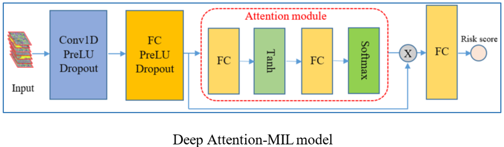

# Deep Attention-MIL to predict the metastasis risk for Sarcoma patients

## Description

This project contains the source program of the Deep Attention Multiple Instance Learning (Deep Attention-MIL) model.
This model is used to provide the risk score of metastasis for the Sarcoma patients.
The study is based on the extracted features from different areas of tumors and these combinations.
The outputs of the model are used as an input in another model to analyze the role of each area in the treatment of Sarcoma cancer.

## Installation

- Linux (Ubuntu 20.04.6 LTS)
- NVIDIA GPU (Nvidia Quadro RTX 6000)
- Python3 (3.8.10), PyTorch (2.2.2), torchvision (0.13.1), pytorch-lightning (1.5.7), numpy (1.21.5)

## The source code
The program to train/test the model are implemented in the following files:
<ul>
	<li><i>main_survival.py</i>: The main file to train the model.</li>
	<li><i>main_survival_cv.py</i>: The main file to train the model in K-fold cross-validation.</li>
	<li><i>model_pl_survival.py</i>: The process to handle the training process.</li>
	<li><i>model_attention_survival.py</i>: The Deep Attention-MIL model.</li>
	<li><i>MIL_attention.py</i>: The Attention module.</li>
	<li><i>bergonie_dataloader_survival_wsi.py</i>: The file to load and create the Dataset, Dataloader</li>
	<li><i>IGR1_Bergo_inference_one_region.py</i>: The inference of the trained model which has been trained on one area, applied on Beroginé and IGR_1 Set.</li>
	<li><i>IGR2_inference_one_region.py</i>: The inference of the trained model which has been trained on one area, applied on IGR_2 Set.</li>
	<li><i>IGR1_Bergo_inference_combination.py</i>: The inference of the trained model which has been trained on combination of areas, applied on Beroginé and IGR_1 Set.</li>
	<li><i>IGR2_inference_combination.py</i>: The inference of the trained model which has been trained on combination of areas, applied on IGR_2 Set.</li>
	<li><i>loss_2.py</i>: The losses.</li>
</ul>
